# flutter_authflow_advanced


<div style="text-align: center;">


</div>


Advanced Flutter example implementing a **real OAuth2 / OIDC Authorization Code + PKCE** login with  
[`flutter_appauth`](https://pub.dev/packages/flutter_appauth), secure token storage, and automatic Dio refresh logic.  
Runs on **Android / iOS**, using any standards-compliant OpenID Connect provider (Auth0, Keycloak, Django OAuth Toolkit, etc.).

---

## ✨ What this demonstrates

- **Real Authorization Code + PKCE** exchange (no mocks)
- **Secure storage** via `flutter_secure_storage`
- **Automatic refresh** via Dio interceptor on 401
- **Logout** using OIDC `end_session_endpoint`
- **Dependency injection** with `GetIt`
- **Unit tests** for login / refresh / logout and refresh-on-401 retry
- **CI pipeline** with GitHub Actions + coverage upload

---

## 🔐 Auth Flow (OIDC + PKCE) — Diagram

```mermaid
sequenceDiagram
    participant User
    participant App as Flutter App
    participant IdP as OIDC Provider
    participant API as Protected API

    User->>App: Tap "Sign in"
    App->>App: generate PKCE (verifier + challenge)
    App->>IdP: /authorize?code_challenge=S256(...)
    IdP-->>App: Redirect → redirectUri?code=XYZ
    App->>IdP: /token (code + code_verifier)
    IdP-->>App: {access_token, refresh_token, id_token, exp}
    App->>App: Store tokens securely (FlutterSecureStorage)
    App->>API: GET /secret (Authorization: Bearer access_token)
    API-->>App: 200 OK 🔒

    Note over App, IdP: When access_token expires →
    App->>IdP: /token (grant_type=refresh_token)
    IdP-->>App: new {access_token, expires_at}
    App->>API: Retry request
    API-->>App: 200 OK
```




-------------------------------------------------------------------------

```text
🧱 Architecture
bash
Copy code
lib/
 ├─ main.dart
 ├─ app.dart
 ├─ core/
 │   ├─ auth/app_auth_service.dart
 │   ├─ network/
 │   │    ├─ auth_interceptor.dart
 │   │    └─ refresh_interceptor.dart
 │   ├─ di/locator.dart
 │   └─ storage/token_store_impl.dart
 ├─ features/
 │   └─ auth/
 │        ├─ data/auth_repository.dart
 │        └─ domain/token_set.dart
 └─ presentation/
      ├─ login_page.dart
      ├─ consent_page.dart
      ├─ callback_page.dart
      └─ home_page.dart
```
-------------------------------------------------------------------------

🧩 Key Ideas
AuthRepository orchestrates the entire flow:
beginAuth → exchangeCode → refresh → logout

Dio interceptors keep API code clean — all Authorization and refresh logic lives centrally.

Real OIDC provider replaces mock servers from the Pro version.

RefreshInterceptor seamlessly retries failed 401s after token renewal.

Logout calls the OIDC end_session_endpoint and clears secure storage.


class AppEnv {
static const auth0Domain = 'YOUR_TENANT.auth0.com';
static const auth0ClientId = 'YOUR_CLIENT_ID';
static const redirectUri = 'https://com.example.flutter_authflow_advanced';
static const logoutRedirectUri = 'https://com.example.flutter_authflow/';
static String get discoveryUrl =>
'https://$auth0Domain/.well-known/openid-configuration';
static const scopes = ['openid', 'profile', 'email', 'offline_access'];
}
⚠️ Auth0 / OIDC setup:
Allowed Callback URLs → https://com.example.flutter_authflow_advanced
Allowed Logout URLs → https://com.example.flutter_authflow/

-------------------------------------------------------------------------

🧪 Tests

# ▶️ Run the app
flutter pub get
flutter run -d emulator-5554   # or your Android / iOS device

# Run all tests
flutter test --no-pub -j 1 -r expanded

# Run specific files
flutter test test/auth_repository_test.dart -r expanded
flutter test test/dio_refresh_interceptor_test.dart -r expanded

# Generate coverage report
flutter test --coverage --no-pub
genhtml coverage/lcov.info -o coverage/html   # then open coverage/html/index.html

Included tests:

File	                              What it verifies
auth_repository_test.dart	          login, refresh, logout
dio_refresh_interceptor_test.dart     401 → refresh → retry flow

-------------------------------------------------------------------------

🔌 Network & Token Flow
All API calls go through buildAuthedDio():

Attaches the latest Authorization: Bearer <access_token>

Intercepts 401 Unauthorized responses

Triggers a silent refresh token flow

Retries the failed request automatically

If refresh fails → clears tokens & navigates to login

🖥️ Screens

Login → native browser → Home (protected)
Logout → clears tokens → back to Login

Login	Home


## ⚙️ Tech Stack

- **Flutter**, **Dart**
- **flutter_appauth** – real OAuth2 / OIDC PKCE login
- **Dio** – API networking & interceptors
- **GetIt** - dependency injection
- **Flutter Secure Storage** – encrypted token persistence
- **mocktail** – flutter_test – testing
- **GitHub Actions** – automated CI + coverage


🧠 How It Differs from AuthFlow Pro
Feature	AuthFlow Pro (Mock)	AuthFlow Advanced (Real)
Auth Server	Local mock class (MockAuthServer)	Real OIDC provider (Auth0, etc.)
Storage	Local / GetStorage	Secure / FlutterSecureStorage
Flow	Simulated PKCE exchange	Real browser-based AppAuth flow
Logout	Local clear only	OIDC end_session + clear
Tests	Mock-only	Real token + Dio refresh logic

| Feature              | **AuthFlow Pro (Mock)**                         | **AuthFlow Advanced (Real)**                                    |
| :------------------- | :---------------------------------------------- | :-------------------------------------------------------------- |
| **Auth Server**      | 🧱 Local `MockAuthServer` (simulated endpoints) | 🌍 Real OIDC provider (Auth0 / Keycloak / Django OAuth Toolkit) |
| **PKCE Flow**        | 🧩 Simulated authorization code flow            | 🔑 Real Authorization Code + PKCE via `flutter_appauth`         |
| **Token Storage**    | 💾 `GetStorage` (local unsecured storage)       | 🔐 `FlutterSecureStorage` (encrypted native storage)            |
| **Dio Interceptors** | 🌐 Single Authorization header only             | ⚙️ Full Auth + Refresh interceptors with 401 auto-retry         |
| **Token Refresh**    | 🚫 None (manual expiry simulation)              | ♻️ Automatic refresh via `RefreshInterceptor`                   |
| **Logout Flow**      | 🚪 Local token clear only                       | 🚀 OIDC `end_session_endpoint` + secure logout                  |
| **Testing Coverage** | 🧪 Mock-only PKCE and storage tests             | ✅ Real login / refresh / logout + Dio retry unit tests          |
| **Security Level**   | 🔓 Dev/demo grade                               | 🛡️ Production-ready (PKCE S256 + encrypted tokens)             |
| **CI Integration**   | ⚙️ Manual testing                               | 🤖 GitHub Actions CI + coverage upload                          |
| **Use Case**         | 🧰 Educational demo                             | 🚀 Showcase of real enterprise-grade OIDC integration           |

⚙️ Continuous Integration (GitHub Actions)
Runs automatically on every push / PR:
```bash
Steps:

flutter pub get

flutter analyze

flutter test --coverage

Uploads coverage artifact
```
📄 License
MIT © 2025 Parastoo Shaabani
